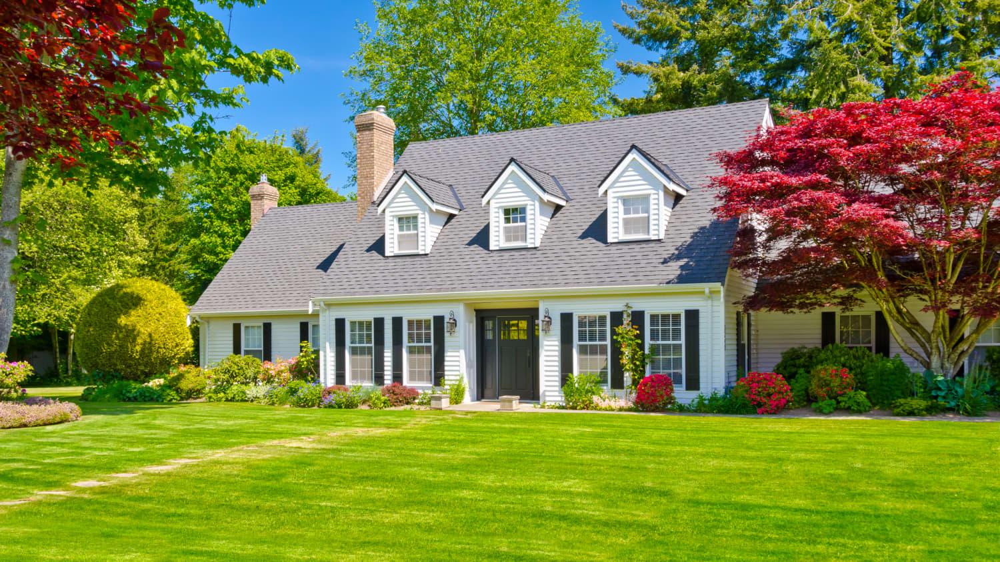
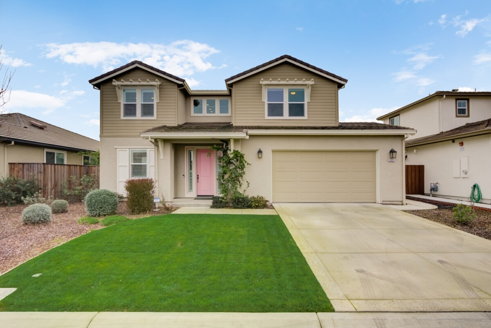
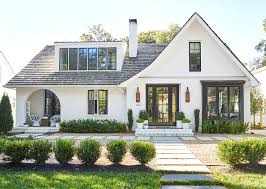

[index.html](https://github.com/user-attachments/files/26231009/index.html)
<!DOCTYPE html>
<html lang="en">
<head>
  <meta charset="UTF-8" />
  <meta name="viewport" content="width=device-width, initial-scale=1.0" />
  <title>Bishop Real Estate Strategies</title>
  <link rel="stylesheet" href="styles.css" />
</head>
<body>
  <header class="site-header">
    

      <a href="#" class="brand">Bishop Real Estate Strategies</a>
      <button class="nav-toggle" id="navToggle" aria-label="Open menu" aria-expanded="false">☰</button>
      <nav class="nav" id="mainNav" aria-label="Primary">
        <a href="#services">Services</a>
        <a href="#property">Properties</a>
        <a href="#about">About</a>
        <a href="#teams">Team</a>
        <a href="#blog">Insights</a>
        <a href="#contact">Contact</a>
      </nav>
      

        <a href="#investor" class="btn btn-tertiary">Investor Login</a>
        <a href="#contact" class="btn btn-primary">Request Info</a>
      

    

  </header>

  <main>
    <section class="hero" aria-label="Hero">
      

        

          
CREATING STRONGER PLACES

          <h1>Local property management built on transparency and outcomes</h1>
          
Managing 10,000+ units with real-time performance insights, agile operations, and trusted owner alignment.

          

            <a href="#services" class="btn btn-primary">See Services</a>
            <a href="#contact" class="btn btn-secondary">Get Started</a>
          

          

            
<strong>10+</strong>Markets

            
<strong>30K+</strong>Units Managed

            
<strong>25%</strong>Avg NOI Growth

          

        

        

          
        

      

    </section>

    <section id="dashboard" class="section dashboard">
      

        <h2>Property Management Dashboard</h2>
        

          

            
Access real-time portfolio performance, lease expirations, maintenance requests, and financial health—all from one dashboard. Our platform integrates occupancy, rent roll, and expense tracking so you can prioritize high-impact actions.

            <ul>
              <li>Live occupancy and leasing funnel visuals</li>
              <li>Tenant communication & maintenance ticket tracking</li>
              <li>Cash flow forecasting and budgeting tools</li>
            </ul>
          

          

            
          

        

      

    </section>      

    </section>

    <section id="services" class="section services">
      

        <h2>What we do</h2>
        
end-to-end operations across residential, retail, and office portfolios.

        

          <article class="card">
            <h3>Property Management</h3>
            
Leasing, maintenance, and tenant services with proactive cost control.

          </article>
          <article class="card">
            <h3>Asset Management</h3>
            
Monthly reporting, budgeting, and capital planning to drive returns.

          </article>
          <article class="card">
            <h3>Development Advisory</h3>
            
Pre-construction underwriting, entitlements, and project oversight.

          </article>
          <article class="card">
            <h3>Construction Management</h3>
            
Quality-first vendor management and schedule adherence.

          </article>
        

      

    </section>

    <section id="investor" class="section investor-login">
      

        

          <h2>Investor portal</h2>
          
Access reporting, filings, and investment performance securely.

          <ul>
            <li>Secure login with MFA</li>
            <li>Real-time operating dashboards</li>
            <li>Standardized investor deliverables</li>
          </ul>
        

        <form class="login-card" aria-label="Investor login">
          <label>Email<input type="email" placeholder="investor@example.com" required></label>
          <label>Password<input type="password" required></label>
          <button class="btn btn-primary" type="submit">Sign in</button>
          
<a href="#">Forgot password?</a>

        </form>
      

    </section>

    <section id="property" class="section property-grid">
      

        <h2>Property Development & Investment</h2>
        
Data-driven acquisition, entitlement, and delivery with capital protection and risk management.

        

          <article class="card">
            <h3>The Marigold Apartments</h3>
            
High-density multifamily with 94% occupancy and ESG-certified operations.

          </article>
          <article class="card">
            <h3>Riverfront Retail Center</h3>
            
Mixed-use retail with demand-based leasing and 100% storefront occupancy.

          </article>
          <article class="card">
            <h3>Urban Innovation Campus</h3>
            
Office campus with creative tenant mix and shorter cycle leasing.

          </article>
          <article class="card">
            <h3>Hillcrest Industrial Park</h3>
            
Logistics hub with optimized CAPEX and long-term tenants.

          </article>
        

      

    </section>

    <section id="about" class="section about">
      

        

          <h2>About Bishop Real Estate Strategies</h2>
          
A Southern California firm delivering scalable development, appraisal, and management solutions since 2008.

          <ul>
            <li>Investor-aligned governance</li>
            <li>Local team presence</li>
            <li>Data-driven continuous improvement</li>
          </ul>
        

          

      

    </section>

    <section id="scope" class="section scope-services">
      

        <h2>Scope of Services</h2>
        <h3>Property Development</h3>
        
Property development is the strategic process of identifying underutilized land or assets and unlocking value through disciplined planning, entitlement strategy, construction, and execution. We evaluate opportunities from feasibility through completion, focusing on financing structure, market demand, and exit strategy.

        <h3>Fiduciary-First Approach</h3>
        
Ethics and fiduciary responsibility are the core of our practice. Every recommendation protects client capital, minimizes risk, and aligns with long-term objectives. Integrity isn’t a slogan; it’s the standard applied at every stage.

        <h3>One-Stop Development Platform</h3>
        <ul>
          <li>Title & escrow coordination</li>
          <li>Bridge, hard money, rehab, take-out, and HELOC lender access</li>
          <li>Contractor and construction oversight</li>
          <li>Insurance & risk management solutions</li>
          <li>Trust & probate attorney network</li>
          <li>Transaction coordination & 1031 exchange support</li>
          <li>Comprehensive inspections: pest, termite, pool, solar, specialty trades</li>
          <li>Legal protection program for investor security</li>
        </ul>
      

    </section>

    <section id="teams" class="section teams">
      

        <h2>Regional teams</h2>
        
Our local leaders across the U.S.

        

          <article class="card">
            <h3>Chicago</h3>
            
Portfolio ops, lease-up, vendor management.

          </article>
          <article class="card">
            <h3>Atlanta</h3>
            
Asset oversight, performance engineering.

          </article>
          <article class="card">
            <h3>Denver</h3>
            
Capital projects, ESG tracking.

          </article>
          <article class="card">
            <h3>Seattle</h3>
            
Tenant retention and community engagement.

          </article>
        

      

    </section>

    <section id="blog" class="section blog">
      

        <h2>Insights</h2>
        
News and resources for owners and operators.

        

          <article class="card">
            <h3>Driving NOI with Active Lease Management</h3>
            
How predictive analytics reduces vacancy and improves rent capture.

          </article>
          <article class="card">
            <h3>Retrofitting for Efficiency</h3>
            
Capital improvements that drive long-term net operating income.

          </article>
          <article class="card">
            <h3>Market Snapshot: Q1 Multifamily</h3>
            
Regional performance trends and leasing velocity insights.

          </article>
        

      

    </section>

    <section id="insights" class="section insights-tabs">
      

        <h2>Explore our highlights</h2>
        

          <button class="tab active" role="tab" aria-selected="true" data-tab="projects">Past Projects</button>
          <button class="tab" role="tab" aria-selected="false" data-tab="team">Our Team</button>
          <button class="tab" role="tab" aria-selected="false" data-tab="reviews">Reviews</button>
        

        <article class="tab-panel active" id="projects" role="tabpanel" aria-labelledby="projects-tab">
          

            
<strong>12</strong>Completed Projects

            
<strong>$35M+</strong>Total Property Value

            
<strong>4</strong>Cities Invested

            
<strong>8</strong>Years Experience

          

          

            <article class="project-card"><h4>Yorba Linda Townhomes</h4>
1,425 sq. ft, 3 bd / 2 ba • Acquired Jan 2018 • Cap Rate 6.2%
</article>
            <article class="project-card"><h4>La Puente Redevelopment</h4>
1,580 sq. ft, 3 bd / 2.5 ba • Acquired Aug 2019 • Cap Rate 6.5%
</article>
            <article class="project-card"><h4>Hemet Portfolio</h4>
1,760 sq. ft, 4 bd / 2 ba • Acquired Mar 2020 • Cap Rate 7.0%
</article>
            <article class="project-card"><h4>Homeland Infill</h4>
1,985 sq. ft, 4 bd / 3 ba • Acquired Nov 2021 • Cap Rate 6.8%
</article>
          

        </article>

        <article class="tab-panel" id="team" role="tabpanel" aria-labelledby="team-tab">
          

            <article class="team-card"><strong>Vincent Disanza</strong>Owner & Founder
SRA-designated appraiser with 20+ years experience. Fiduciary-first, accuracy-focused valuations with real estate strategy access.
</article>
            <article class="team-card"><strong>Charles Jackson</strong>COO
10+ years in prop-tech operations and portfolio optimization, building reporting systems for owner transparency.
</article>
            <article class="team-card"><strong>Amanda Ruiz</strong>Development Director
Expert in entitlement, construction management, and investment analysis for land + adaptive reuse.
</article>
          

        </article>

        <article class="tab-panel" id="reviews" role="tabpanel" aria-labelledby="reviews-tab">
          

            <blockquote>
"Wow, what a great realtor! Amazing customer service and deep market knowledge."
<footer>– Cool Person</footer></blockquote>
            <blockquote>
"Professional, transparent, and very responsive. Highly recommend for development guidance."
<footer>– Happy Investor</footer></blockquote>
          

        </article>
      

    </section>

    <section id="contact" class="section contact">
      

        

          <h2>Connect with us</h2>
          
Start a conversation with a portfolio director to design your management plan.

        

        <form class="contact-form" aria-label="Contact form">
          <label>Full name<input type="text" placeholder="Your name" required/></label>
          <label>Company<input type="text" placeholder="Company name" required/></label>
          <label>Email<input type="email" placeholder="you@example.com" required/></label>
          <label>Message<textarea rows="4" placeholder="We are interested in ..." required></textarea></label>
          <button class="btn btn-primary" type="submit">Submit</button>
        </form>
      

    </section>
  </main>

  <footer class="footer">
    

      
© 2026 Bishop Real Estate Strategies. All rights reserved.

      <nav class="footer-nav"
        <a href="#">Privacy</a>
        <a href="#">Terms</a>
        <a href="#">Sitemap</a>
      </nav>
    

  </footer>

  
</body>
</html>
